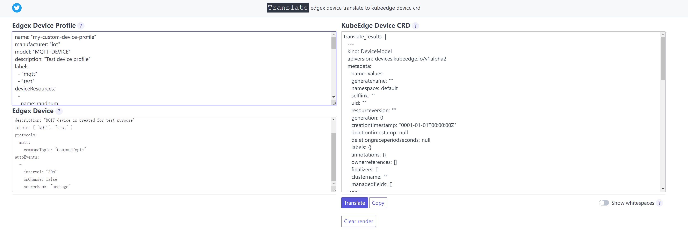

### edgex设备属性影子

经过上一阶段对edgex与kubeedge的设备影子调研，edgex支持的所有设备创建设备影子不适合。因为edgex支持的设备属性有数组，对象类型。这些类型在kubeege中目前还没法加入设备影子的属性。并且modbus协议的设备暂时没有条件验证。

因此，作了以下设计前提

（1）、退一步，不以设备为单位创建设备影子。以设备属性为单位创建设备属性影子。（以后，kubeedge设备影子支持数组和对象了，在把该属性赋予创建设备属性影子功能）

（2）、只对mqtt协议的设备属性创建设备属性影子

步骤如下

1、获取device设备的所有devicecommand，每个设备的devicecommand不一定是对设备的全部属性进行操作，只是操作设备属性的其中几个。在设备的所有devicecommand，找出其中操作设备属性全都属于这6种（boolean,bytes,double,float,int,string）中。过滤出设备的devicecommand。

2、针对每个过滤出的devicecommand可以创建一个以该devicecommand名称命名的设备属性影子，设备属性为devicecommand操作的属性。设备属性影子在服务端为k8s crd devicemodel和deviceinstance。

### 目录说明

ui：简单的前端界面
middleware：web访问跨域处理
model：edgex device deviceprofile数据结构，中转的kubeedge devicemodel 数据结构
v1alpha2： 生成kubeedge crd的devicemodel，deviceinstance定义

### 运行程序
首先，运行后端golang程序，步骤如下
```
#下载依赖包
go mod tiry
#运行
go run main.go
```
运行前端程序
用浏览器打开ui文件夹下translate.html文件即可
输入edgex的device profile和device，点击Translate按钮，即可生成kubeedge的devicemodel，deviceinstance的yaml资源格式。

运行效果
